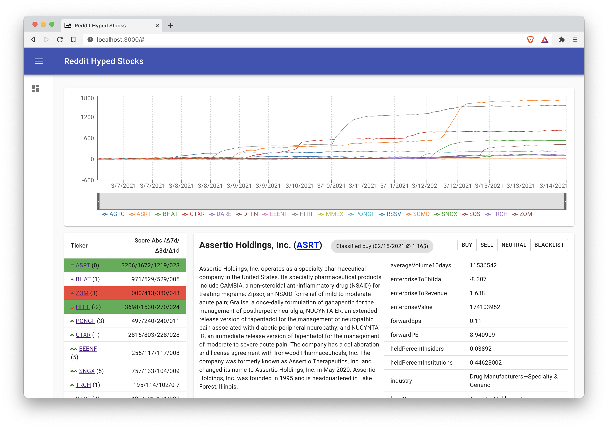
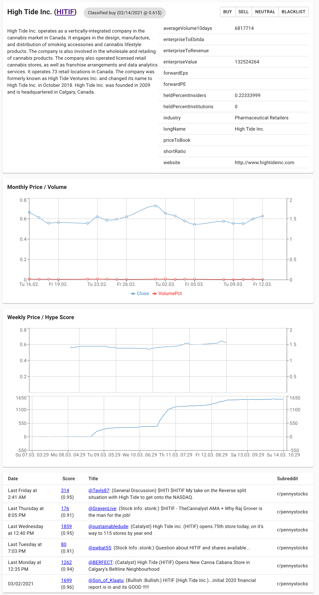

# Reddit Hyped Stocks

A web application to explore currently hyped stocks on Reddit.

## Features & Description

### Overview

#### Hype Chart (on the top)

The chart displays the currently most hyped stock tickers on Reddit. How "hype" is defined see section "How the hype scores are calculated".
The chart shows the accumulated hype scores of the top 15 stocks. 
By default the one week is displayed, but it is possible to further zoom in by using the lens.

#### Hype table (on the left)

Displays the top 30 hyped stocks, and their respective hype scores.
The following values are displayed: 

- Score Abs: Sum of the absolute Reddit score of all matching posts
- Δ7d/Δ3d/Δ1d: The 7/3/1 day hype score

Additionally, each row has an indication of the one day position gain/loss (two up/down arrows for more than +/- 5 positions, one up/down arrow for less than +- 5 positions, = for unchanged position).

If a ticker is marked as buy or sell, the row background will be green or red.

When a ticker is clicked, the detail view is opened.

### Ticker detail view (on the right)

Detailed information for on stock ticker is shown on the right.

#### Company details

The first cell displays detailed information of the company including the descriptions and selected key figures. The data is queried live from Yahoo Finance.

The buttons on the right allow to classify a certain ticker as:
- buy/sell: The stock will be marked as "buy"/"sell", the current price and the current date will be remebered, and displayed persitently. The Hype table will highlight the stock ticker and also the stock ticker will stick in the Hype table (even when it falls out of the top 30).
- neutral: To remove a classification. The stock ticker isn't sticky in the Hype table anymore.
- blacklist: To hide the stock ticker in the hype table. Useful when a certain string is not correctly recognized as a stock ticker.

#### Monthly price/volume

Shows a chart of the monthly close prices of the stock and the volume as a percentage of the average volume.

#### Weekly price/hype score

Shows a chart of the weekly intraday prices of the stock (first chart) and the growth of the hype score (second chart).

#### Post list

Shows a table of all posts which contain the stock ticker. The post score are the basis to calculate the hype score.

### How the hype scores are calculated

The hype score is calculated as follows:

The collected raw data contains the top n posts of the selected subreddits.
For each time point (e.g. every hour) the raw posts including the absolute reddit post scores (upvotes - downvotes) are collected.

Each post is will be tagged with one or more stock tickers (based on the headline).

Then a matrix is built where each row represents one point in time and each column represents one stock ticker. 
The values of the matrix represent the sum of the absolute reddit score of all posts which are related to one stock ticker at a certain time point in time.

Then the difference over time is calculated (i.e. we calculate the delta value for each point in time compared to the last value).  

Out of the resulting matrix we can then for example calculate the 7d score by taking the sum over the delta values over the last 7 days.

For the exact algorithm, check out `ticker_score_calulation.py`.

The advantage of this more complex method compared to just taking the absolute post values, is (I believe) that the absolute post values does not matter too much, but really how much score one post gains/looses in a certain time period. This should more closely reflect the recent popularity (hype) of one post/ticker.

### How to identify interesting stocks

1) Check out the Hype chart and Hype table for recent gainers, e.g. Hype score line is steep, 1d score is high compared to others, stock ticker gained positions in the Hype table
2) Checkout the detail view, check the key figures (e.g. P/E, short ratio, avg. volume last week compared to long term avg.)
3) Look at the relative volume chart (high volume *could* indicate manipulations)
4) Compare hype to stock price
5) Take a detailed look at the posts table (supicious posters, upvote ratio)
6) Profit

## Getting started

### Run the application with Docker:

1) Clone or download the repository to your local computer
2) To use the example data run `cp backend/data.db.example backend/data.db`
3) Run `./run-server-docker.sh` - this will take a while to download the depedencies and build the application
4) Open the browser at http://localhost:5000

### Run the application without Docker / Setup a dev environment

1) Clone the repository to your local computer
2) Install Python 3 and Node.js
3) Go to `backend` and run `pip3 install -r requirements.txt` to install the backend dependencies. Run `backend/start.sh` to run the backend dev server
4) Go to `frontend` and run `npm i` to install the frontend dependencies. Run `npm run start` to run the frontend dev server (React).

### Collecting the raw data

Since the hype score relies on the difference of the post scores, the raw Reddit post data has to queried periodically (e.g. every hour). 

Prerequisite: Get a Reddit API token:
1) Go to https://www.reddit.com/prefs/apps 
2) Click "Create an app" and fill out the information - use "Script" type
3) Copy the secret and app id to the file `backend/praw.ini`

By default the subreddits `robinhoodpennystocks` and `pennystocks` are queried (configurable in `backend/load_data.py`). 

The data is saved into a Sqlite database. 
To query the data use the script `backend/load_data.py` or run `./run-load-data-docker.sh`.

You can for example set up a Cron job to load the data periodically.

## Technical information

This application uses:

On the backend

- Python 3
- Flask web application framework
- sqlalchemy library 
- PRAW/yfinance to query the respective APIs

On the frontend
- React
- the Create React App tool
- the new React Hooks API
- material-ui as the UI framework

## Disclaimer

This application does not offer investment advice. Do you not invest what you cannot afford to lose. You should carry out your own independent research before making any investment decision.

This application is not affiliated with Reddit or Yahoo Finance.

## License

MIT

